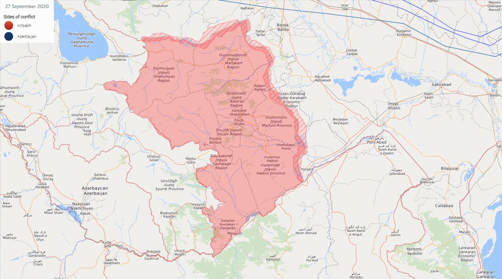
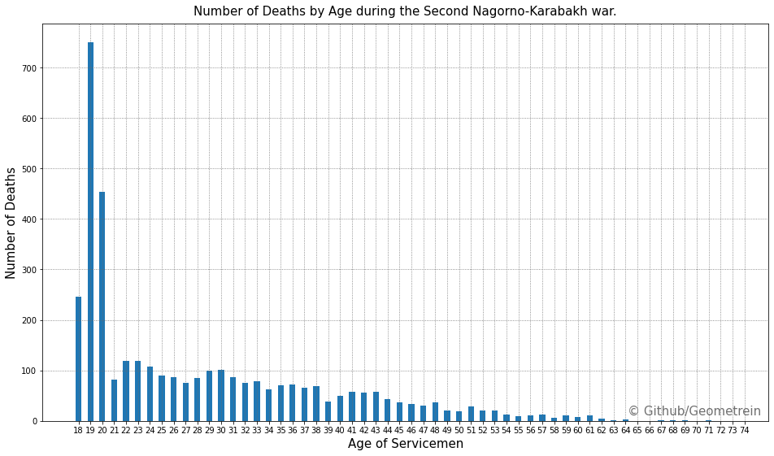

# 2020-Nagorno-Karabakh-War

### **Backstory**
---
The 2020 Nagorno-Karabakh war was an armed conflict in the disputed region of Nagorno-Karabakh and the surrounding territories. The main combatants were Azerbaijan, with support from Turkey and foreign mercenary groups, on one side and the self-proclaimed Republic of Artsakh and Armenia on the other side.

### **About**
---
This repo contains a brief analysis of the demographics of causalities of the armenian army during the second Nagorno-Karabakh conflict. I was interested to see who are the real victims of the clash geo political interests. As the graph below illustrates the majority of deceased solders were under 20 years old. This is not unexpected. The majority of conscripts in the armenian defence forces of are under 20. 

>“We, the unwilling, led by the unknowing, are doing the impossible for the ungrateful. We have done so much, for so long, with so little, we are now qualified to do anything with nothing." ― Konstantin Josef Jireček

### **Data Sources**
---
[Casualties data](https://www.1000plus.am/en)
